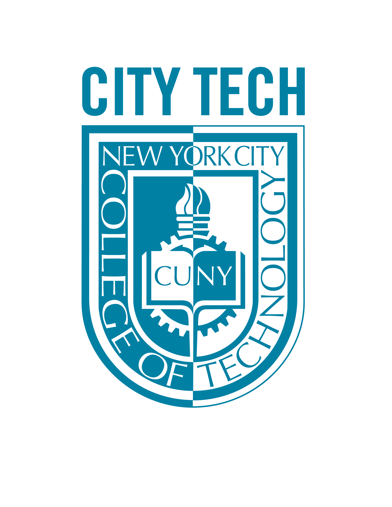
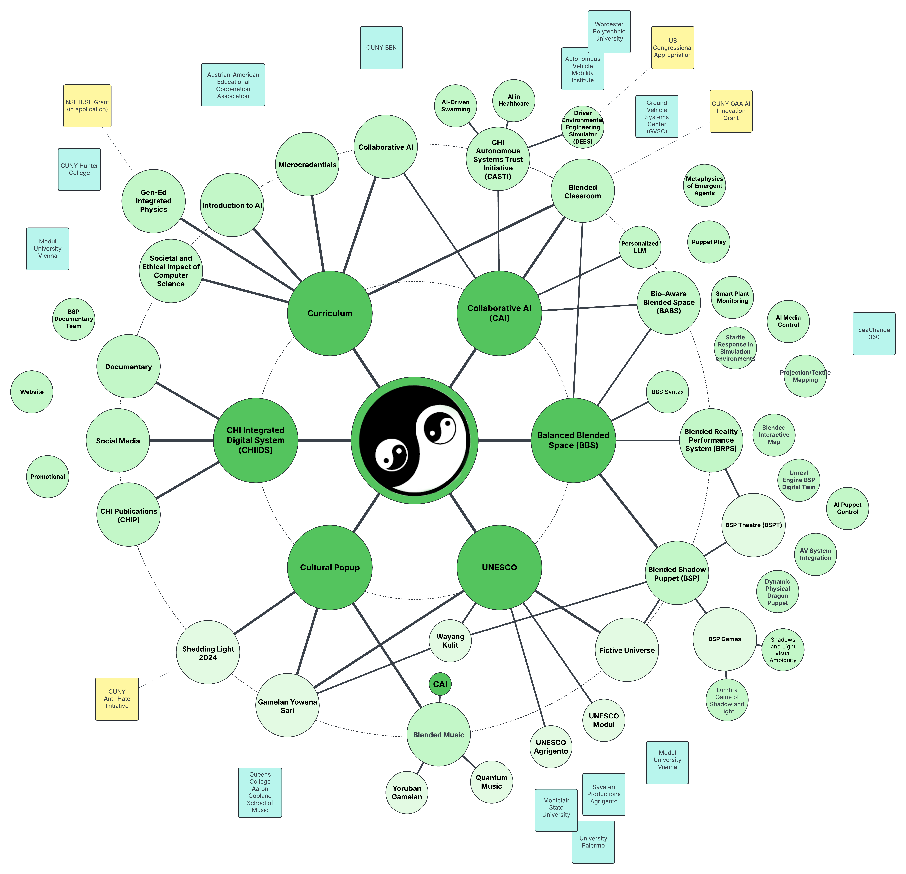

  <a href="#current-term-summer-fall-2026">🚀 Opportunities</a>
  <a href="https://chi-citytech.github.io/Meta-Project.html">📊 Project Map</a>
  <a href="https://github.com/CHI-CityTech/StudentResearch/wiki/Tutorial-GitHub-Onboarding-&-Project-Management">📚 Onboarding</a>
  <a href="https://github.com/CHI-CityTech">🔗 GitHub Org</a>
  <a href="https://docs.google.com/document/d/1X0aqvqdeZxtAF902jXT1ZbHkHBc3ir7pMu6n1M7OTQ4/edit?tab=t.0#heading=h.tdhe31bdrfnc">⚙️ CHIIDS</a>

  <table width="100%" style="border: none; background: none;">
    <tr style="border: none;">
      <td align="center" width="20%" style="border: none; padding: 0 20px; max-width: 150px;">
        
      </td>
      <td align="center" width="60%" style="border: none; padding: 0 20px; vertical-align: middle;">
        <h1 style="margin: 0; font-size: 2.5em; color: #0D7A88; font-weight: 700; line-height: 1.2;">
          Center for Holistic Integration
        </h1>
        
Research Execution Hub at NYC City Tech

      </td>
      <td align="center" width="20%" style="border: none; padding: 0 20px; max-width: 150px;">
        
      </td>
    </tr>
  </table>

---

## Purpose

This site is the **research-facing entry point** for the Center for Holistic Integration (CHI). It helps students, collaborators, and faculty navigate project opportunities, onboarding materials, and the CHI GitHub ecosystem.

---

## How To Use This Site

<strong>🎓 New to CHI?</strong>

Start with onboarding and orientation resources to understand our research structure and community.

<strong>🔬 Want to Join Research?</strong>

Review current opportunities and StudentResearch pathways to find active projects and contribution areas.

<strong>📊 Exploring Our Structure?</strong>

Use the meta-project hierarchy and CHI GitHub organization to understand how our ecosystem is organized.

---

## Quick Links

### 🚀 Start Here

- **[Summer/Fall 2026 Research Opportunities](https://chi-citytech.github.io/Summer_Fall_2026_Research_Opportunities)** — Current term focus and active projects
- **[CHI Team GitHub Onboarding](https://github.com/CHI-CityTech/StudentResearch/wiki/Tutorial-GitHub-Onboarding-&-Project-Management)** — Onboarding and project management
- **[Meta-Project Hierarchy](https://chi-citytech.github.io/Meta-Project.html)** — Organizational structure overview

---

## What You'll Find Here

- 📚 Onboarding and contribution pathways for student and faculty researchers
- 🔗 Links to active CHI repositories and ecosystem navigation points
- 💼 Current project opportunities and entry routes into ongoing work
- 📈 High-level orientation materials for CHI meta-project structure

---

## Current Term: Summer/Fall 2026

### Active Opportunities

This hub is **updated on a term-cycle basis** to support current-term research onboarding and project discovery. For the current term's active opportunities and participation pathways:

**👉 [View Summer/Fall 2026 Research Opportunities](https://chi-citytech.github.io/Summer_Fall_2026_Research_Opportunities)**

---

## CHI Ecosystem Overview

The Center for Holistic Integration (CHI) operates as a networked ecosystem of interconnected research initiatives, pedagogical projects, and collaborative partnerships. The map below shows how our core frameworks (Curriculum, Collaborative AI, CHIIDS, Balanced Blended Space, and Cultural initiatives) connect with university partners, external collaborators, and specialized projects:

---

## Research Ecosystem Access

- **[CHI-CityTech GitHub Organization](https://github.com/CHI-CityTech)** — All project repositories
- **[StudentResearch Repository](https://github.com/CHI-CityTech/StudentResearch)** — Onboarding, processes, and resources
- **[CHI Integrated Digital System (CHIIDS)](https://docs.google.com/document/d/1X0aqvqdeZxtAF902jXT1ZbHkHBc3ir7pMu6n1M7OTQ4/edit?tab=t.0#heading=h.tdhe31bdrfnc)** — Metadata architecture and integration framework

---

### Scope And Authority

This landing page is an **entry hub**, not the canonical home for all CHI artifacts. Canonical materials remain in their authoritative project repositories and linked systems. Course proposal syllabi and temporary curriculum drafts are not primary navigation targets and should be linked from project-specific pages when needed.

